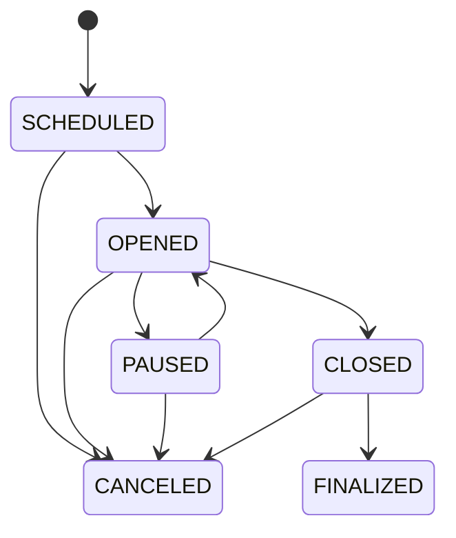

# Ceremonies

Ceremonies are the central unit of work in Brebaje. This page explains how ceremonies work, their lifecycle, and how to manage them effectively.

## What is a Ceremony?

A ceremony in Brebaje represents a complete trusted setup process. It coordinates participants, manages circuits, tracks contributions, and ensures the secure generation of cryptographic parameters.

## Ceremony Structure

### Basic Information

Every ceremony has:

- **ID**: Unique identifier for the ceremony
- **Project ID**: Links the ceremony to a project
- **Description**: Human-readable description of the ceremony
- **Timeline**: Start and end dates
- **Penalty**: Timeout penalty in seconds

### State Management

Ceremonies progress through several states:



#### State Descriptions

- **SCHEDULED**: Ceremony is created but not yet accepting participants
- **OPENED**: Ceremony is active and accepting participants
- **PAUSED**: Ceremony is temporarily paused (can be resumed)
- **CLOSED**: Ceremony is no longer accepting new participants
- **CANCELED**: Ceremony has been canceled and cannot be resumed
- **FINALIZED**: Ceremony is complete and parameters are ready

## Creating a Ceremony

### API Endpoint

```bash
POST /ceremonies
```

### Request Body

```json
{
  "projectId": 1,
  "description": "My trusted setup ceremony",
  "start_date": 1640995200,
  "end_date": 1643673600,
  "penalty": 3600,
  "authProviders": ["discord", "github"]
}
```

### Required Fields

- **projectId**: ID of the project this ceremony belongs to
- **description**: Human-readable description
- **start_date**: Unix timestamp when ceremony starts
- **end_date**: Unix timestamp when ceremony ends
- **penalty**: Timeout penalty in seconds

### Optional Fields

- **authProviders**: Array of authentication providers (e.g., "discord", "github")

## Managing Ceremony State

### Opening a Ceremony

```bash
PATCH /ceremonies/{id}
{
  "state": "OPENED"
}
```

### Pausing a Ceremony

```bash
PATCH /ceremonies/{id}
{
  "state": "PAUSED"
}
```

### Closing a Ceremony

```bash
PATCH /ceremonies/{id}
{
  "state": "CLOSED"
}
```

### Finalizing a Ceremony

```bash
PATCH /ceremonies/{id}
{
  "state": "FINALIZED"
}
```

## Ceremony Configuration

### Timeline Management

The ceremony timeline consists of:

- **Start Date**: When the ceremony becomes active
- **End Date**: When the ceremony should be completed
- **Penalty**: Timeout penalty for participants who don't complete in time

### Authentication Providers

Ceremonies can be configured with multiple authentication providers:

- **Discord**: Participants authenticate via Discord
- **GitHub**: Participants authenticate via GitHub
- **Custom**: Custom authentication providers

### Circuit Management

Ceremonies can contain multiple circuits:

```bash
# Add a circuit to a ceremony
POST /ceremonies/{id}/circuits
{
  "name": "my-circuit",
  "timeoutMechanismType": "FIXED",
  "fixedTimeWindow": 3600,
  "sequencePosition": 1,
  "zKeySizeInBytes": 1024,
  "constraints": 1000,
  "pot": 10
}
```

## Monitoring Ceremonies

### Getting Ceremony Information

```bash
# Get ceremony details
GET /ceremonies/{id}

# Get ceremony participants
GET /ceremonies/{id}/participants

# Get ceremony circuits
GET /ceremonies/{id}/circuits

# Get ceremony contributions
GET /ceremonies/{id}/contributions
```

### Real-time Monitoring

Brebaje provides real-time monitoring capabilities:

- **Participant Status**: Track the status of each participant
- **Contribution Progress**: Monitor contribution completion
- **Timeout Alerts**: Get notified when participants timeout
- **Ceremony Progress**: Overall ceremony completion percentage

## Best Practices

### Planning

- **Realistic Timeline**: Set realistic start and end dates
- **Participant Capacity**: Ensure you have enough participants
- **Backup Plans**: Have backup participants in case of dropouts
- **Communication**: Plan how to communicate with participants

### Execution

- **Monitor Progress**: Regularly check ceremony progress
- **Handle Timeouts**: Be prepared to handle participant timeouts
- **Verify Contributions**: Ensure all contributions are verified
- **Document Issues**: Keep records of any issues or delays

### Completion

- **Final Verification**: Verify all contributions before finalizing
- **Parameter Distribution**: Plan how to distribute final parameters
- **Documentation**: Document the ceremony process and results
- **Post-Mortem**: Review what went well and what could be improved

## API Reference

### Endpoints

- `GET /ceremonies` - List all ceremonies
- `POST /ceremonies` - Create a new ceremony
- `GET /ceremonies/{id}` - Get ceremony details
- `PATCH /ceremonies/{id}` - Update ceremony state
- `DELETE /ceremonies/{id}` - Cancel a ceremony
- `GET /ceremonies/{id}/participants` - Get ceremony participants
- `GET /ceremonies/{id}/circuits` - Get ceremony circuits
- `GET /ceremonies/{id}/contributions` - Get ceremony contributions

### Data Types

```typescript
interface Ceremony {
  id: number;
  projectId: number;
  description: string;
  state: CeremonyState;
  start_date: number;
  end_date: number;
  penalty: number;
  authProviders: string[];
}

type CeremonyState = "SCHEDULED" | "OPENED" | "PAUSED" | "CLOSED" | "CANCELED" | "FINALIZED";
```

## Next Steps

Now that you understand ceremonies, you can:

- **[Circuits](./circuits)**: Learn about circuit configuration
- **[Participants](./participants)**: Understand participant management
- **[Contributions](./contributions)**: Learn about the contribution process
- **[User Guide - Creating Ceremonies](./../user-guide/creating-ceremony)**: Practical guide to creating ceremonies
