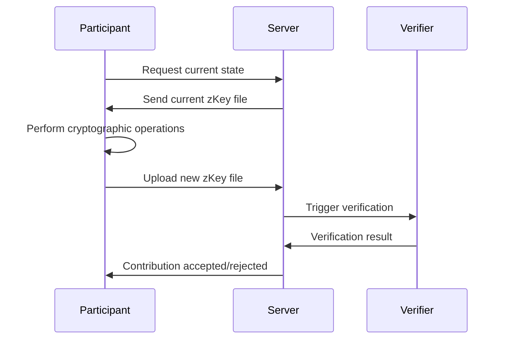

# Contributions

Contributions are the core cryptographic work performed by participants in trusted setup ceremonies. This page explains how contributions work, how they're verified, and how to manage them.

## What is a Contribution?

A contribution in Brebaje represents the cryptographic work performed by a participant. Each participant downloads the current state, performs mathematical operations, and uploads the updated state to advance the ceremony.

## Contribution Process

### Overview

The contribution process consists of four main steps:

1. **Download**: Get the current state from the previous participant
2. **Compute**: Perform the cryptographic operations
3. **Upload**: Submit the new state
4. **Verify**: Validate the contribution

### Detailed Flow



## Contribution Structure

### Basic Information

Every contribution has:

- **ID**: Unique identifier for the contribution
- **Circuit ID**: Links to the circuit being contributed to
- **Participant ID**: Links to the participant making the contribution
- **ZKey Index**: Position in the contribution sequence
- **Timing Information**: Various timing measurements
- **Files**: Associated contribution files

### Contribution Properties

```typescript
interface Contribution {
  id: number;
  circuitId: number;
  participantId: number;
  contributionComputationTime: number;
  fullContributionTime: number;
  verifyContributionTime: number;
  zkeyIndex: number;
  valid: boolean;
  lastUpdated: number;
  files: any;
  verificationSoftware: any;
  beacon: any;
}
```

## Contribution Steps

### 1. Download Phase

The participant downloads the current state:

```bash
# Get current zKey file
GET /circuits/{circuitId}/current-zkey

# Response includes:
{
  "zkeyFile": "circuit_0001.zkey",
  "zkeyIndex": 1,
  "downloadUrl": "https://storage.example.com/circuit_0001.zkey"
}
```

### 2. Compute Phase

The participant performs cryptographic operations:

```bash
# Update contribution progress
PATCH /participants/{participantId}
{
  "contributionStep": "COMPUTING",
  "contributionProgress": 50
}
```

### 3. Upload Phase

The participant uploads the new state:

```bash
# Upload new zKey file
POST /circuits/{circuitId}/contributions
Content-Type: multipart/form-data

{
  "zkeyFile": <file>,
  "participantId": 1,
  "contributionComputationTime": 1800,
  "fullContributionTime": 2400
}
```

### 4. Verify Phase

The contribution is automatically verified:

```bash
# Check verification status
GET /contributions/{contributionId}

# Response:
{
  "id": 1,
  "valid": true,
  "verifyContributionTime": 120,
  "verificationSoftware": {
    "type": "snarkjs",
    "version": "0.7.0"
  }
}
```

## Contribution Verification

### Automatic Verification

All contributions are automatically verified:

1. **Format Check**: Verify the zKey file format is correct
2. **Mathematical Check**: Verify the cryptographic operations
3. **Consistency Check**: Verify consistency with previous contributions
4. **Beacon Check**: Verify the beacon contribution (if applicable)

### Verification Software

Brebaje supports multiple verification tools:

```json
{
  "verificationSoftware": {
    "type": "snarkjs",
    "version": "0.7.0",
    "options": {
      "verbose": true,
      "checkContribution": true
    }
  }
}
```

### Manual Verification

Contributions can also be verified manually:

```bash
# Manual verification
POST /contributions/{id}/verify
{
  "verificationSoftware": {
    "type": "snarkjs",
    "version": "0.7.0"
  }
}
```

## Contribution Timing

### Timing Measurements

Brebaje tracks various timing measurements:

- **Contribution Computation Time**: Time spent on cryptographic operations
- **Full Contribution Time**: Total time from download to upload
- **Verify Contribution Time**: Time spent verifying the contribution

### Timing Analysis

```json
{
  "contributionComputationTime": 1800,
  "fullContributionTime": 2400,
  "verifyContributionTime": 120,
  "breakdown": {
    "download": 300,
    "computation": 1800,
    "upload": 300,
    "verification": 120
  }
}
```

## Contribution Files

### File Management

Contributions include various files:

```json
{
  "files": {
    "zkey": "circuit_0002.zkey",
    "contributionHash": "sha256:abc123...",
    "metadata": "contribution_metadata.json"
  }
}
```

### File Storage

Brebaje provides secure storage for contribution files:

- **ZKey Files**: The actual contribution files
- **Metadata**: Information about the contribution
- **Verification Data**: Data used for verification

## Beacon Contributions

### What is a Beacon?

A beacon contribution is a final contribution that uses a publicly verifiable source of randomness (like a blockchain block hash) to ensure the ceremony cannot be influenced by the final participant.

### Beacon Configuration

```json
{
  "beacon": {
    "type": "ethereum",
    "blockNumber": 15000000,
    "hash": "0xabc123...",
    "entropy": "beacon_entropy.bin"
  }
}
```

### Beacon Verification

Beacon contributions are verified to ensure:

- The beacon source is publicly verifiable
- The beacon was generated after the contribution started
- The beacon entropy was correctly applied

## Contribution Statistics

### Performance Metrics

Brebaje tracks various performance metrics:

- **Average Computation Time**: Average time for cryptographic operations
- **Average Verification Time**: Average time for verification
- **Success Rate**: Percentage of successful contributions
- **Timeout Rate**: Percentage of contributions that timeout

### Statistical Analysis

```json
{
  "statistics": {
    "totalContributions": 100,
    "successfulContributions": 95,
    "failedContributions": 5,
    "averageComputationTime": 1800,
    "averageVerificationTime": 120,
    "successRate": 0.95
  }
}
```

## Best Practices

### For Participants

- **Prepare Environment**: Ensure you have sufficient computational resources
- **Monitor Progress**: Keep track of your contribution progress
- **Backup Data**: Keep backups of your contribution files
- **Verify Locally**: Verify your contribution before uploading

### For Coordinators

- **Monitor Verification**: Monitor verification results in real-time
- **Handle Failures**: Have plans for handling failed contributions
- **Document Issues**: Document any issues or anomalies
- **Communicate**: Keep participants informed of verification status

## API Reference

### Endpoints

- `GET /contributions` - List all contributions
- `POST /contributions` - Create a new contribution
- `GET /contributions/{id}` - Get contribution details
- `PATCH /contributions/{id}` - Update contribution
- `DELETE /contributions/{id}` - Delete a contribution
- `POST /contributions/{id}/verify` - Manually verify contribution
- `GET /circuits/{id}/contributions` - Get circuit contributions

### Data Types

```typescript
interface Contribution {
  id: number;
  circuitId: number;
  participantId: number;
  contributionComputationTime: number;
  fullContributionTime: number;
  verifyContributionTime: number;
  zkeyIndex: number;
  valid: boolean;
  lastUpdated: number;
  files: any;
  verificationSoftware: any;
  beacon: any;
}

interface Beacon {
  type: string;
  blockNumber?: number;
  hash?: string;
  entropy?: string;
}
```

## Next Steps

Now that you understand contributions, you can:

- **[User Guide - Participating](./../user-guide/participating)**: Practical guide for making contributions
- **[User Guide - Coordinating](./../user-guide/coordinating)**: Guide for managing contributions
- **[Examples - Basic Ceremony](./../examples/basic-ceremony)**: See a complete contribution example
- **[API Reference](./../api/backend-api)**: Explore the contribution API endpoints
