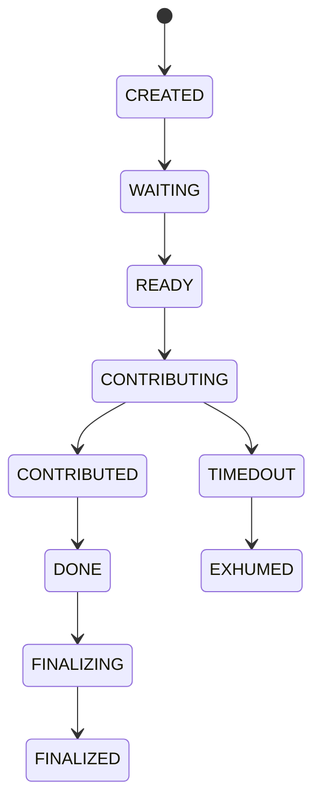
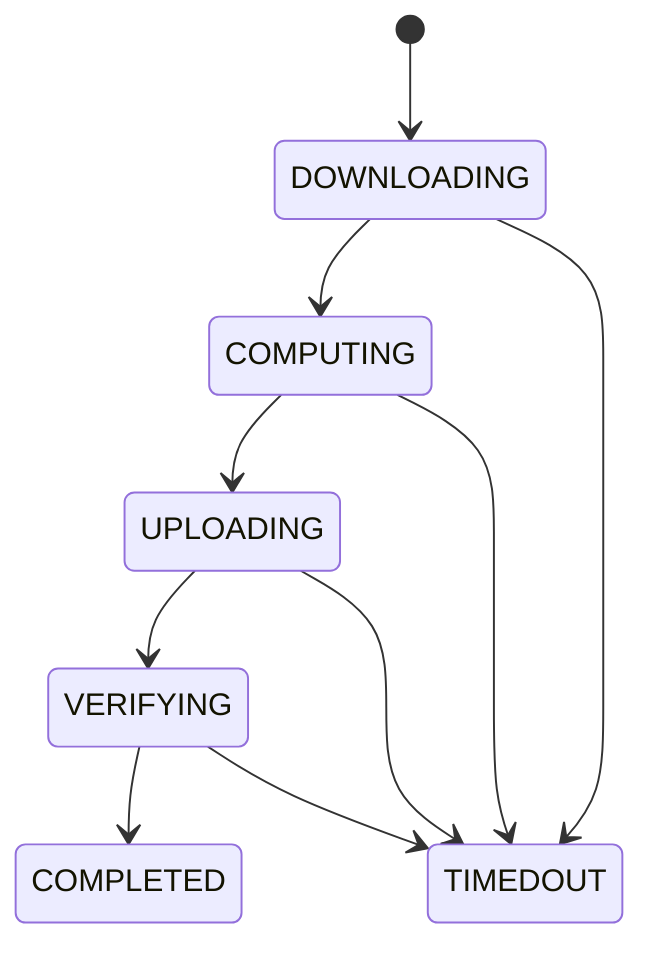

# Participants

Participants are the individuals or entities that contribute to trusted setup ceremonies. This page explains how participant management works in Brebaje.

## What is a Participant?

A participant in Brebaje is someone who contributes to a trusted setup ceremony. Participants download the current state, perform cryptographic operations, and upload their contribution to advance the ceremony.

## Participant Structure

### Basic Information

Every participant has:

- **ID**: Unique identifier for the participant
- **User ID**: Links to the user account
- **Ceremony ID**: Links to the ceremony they're participating in
- **Status**: Current status in the ceremony
- **Contribution Step**: Current step in the contribution process

### Participant Properties

```typescript
interface Participant {
  id: number;
  userId: number;
  ceremonyId: number;
  status: ParticipantStatus;
  contributionStep: ParticipantContributionStep;
  contributionProgress: number;
  contributionStartedAt?: number;
  verificationStartedAt?: number;
  tempContributionData?: any;
  timeout?: any;
}
```

## Participant States

Participants progress through several states during a ceremony:



### State Descriptions

- **CREATED**: Participant is registered but not yet active
- **WAITING**: Waiting for their turn to contribute
- **READY**: Ready to start contribution
- **CONTRIBUTING**: Currently performing contribution
- **CONTRIBUTED**: Contribution completed successfully
- **DONE**: All work for this participant is complete
- **FINALIZING**: Finalizing the ceremony
- **FINALIZED**: Participant's role is complete
- **TIMEDOUT**: Participant failed to complete in time
- **EXHUMED**: Participant was replaced due to timeout

## Contribution Steps

During the contribution process, participants go through these steps:



### Step Descriptions

- **DOWNLOADING**: Downloading the current state from the previous participant
- **COMPUTING**: Performing the cryptographic operations
- **UPLOADING**: Uploading the new state
- **VERIFYING**: Verifying that the contribution was correctly applied
- **COMPLETED**: Contribution is complete and verified

## Registering Participants

### API Endpoint

```bash
POST /participants
```

### Request Body

```json
{
  "userId": 1,
  "ceremonyId": 1,
  "status": "CREATED"
}
```

### Required Fields

- **userId**: ID of the user account
- **ceremonyId**: ID of the ceremony to participate in
- **status**: Initial status (usually "CREATED")

## Managing Participant Status

### Updating Status

```bash
# Mark participant as ready
PATCH /participants/{id}
{
  "status": "READY"
}

# Start contributing
PATCH /participants/{id}
{
  "status": "CONTRIBUTING",
  "contributionStep": "DOWNLOADING"
}
```

### Status Transitions

Common status transitions:

1. **CREATED → WAITING**: Participant is queued for contribution
2. **WAITING → READY**: Participant is ready to contribute
3. **READY → CONTRIBUTING**: Participant starts contribution
4. **CONTRIBUTING → CONTRIBUTED**: Contribution completed
5. **CONTRIBUTED → DONE**: All work complete

## Timeout Handling

### Timeout Configuration

Participants can timeout if they don't complete their contribution in time:

```json
{
  "timeout": {
    "type": "FIXED",
    "duration": 3600,
    "startedAt": 1640995200,
    "expiresAt": 1640998800
  }
}
```

### Timeout Actions

When a participant times out:

1. **Status Update**: Status changes to "TIMEDOUT"
2. **Notification**: Coordinator is notified
3. **Replacement**: Participant can be replaced by another
4. **Exhumation**: Timed out participant is marked as "EXHUMED"

### Handling Timeouts

```bash
# Mark participant as timed out
PATCH /participants/{id}
{
  "status": "TIMEDOUT"
}

# Replace timed out participant
PATCH /participants/{id}
{
  "status": "EXHUMED"
}
```

## Participant Progress Tracking

### Progress Monitoring

Brebaje tracks participant progress in real-time:

```json
{
  "contributionProgress": 75,
  "contributionStartedAt": 1640995200,
  "verificationStartedAt": 1640997000,
  "tempContributionData": {
    "downloadProgress": 100,
    "computationProgress": 75,
    "uploadProgress": 0
  }
}
```

### Progress Updates

```bash
# Update contribution progress
PATCH /participants/{id}
{
  "contributionProgress": 50,
  "contributionStep": "COMPUTING"
}
```

## Participant Verification

### Contribution Verification

All participant contributions are verified:

1. **Format Check**: Verify contribution format is correct
2. **Mathematical Check**: Verify cryptographic operations
3. **Consistency Check**: Verify consistency with previous contributions
4. **Final Verification**: Verify final parameters

### Verification Process

```bash
# Start verification
PATCH /participants/{id}
{
  "contributionStep": "VERIFYING",
  "verificationStartedAt": 1640997000
}

# Complete verification
PATCH /participants/{id}
{
  "contributionStep": "COMPLETED",
  "status": "CONTRIBUTED"
}
```

## Best Practices

### Participant Selection

- **Diversity**: Include participants from different backgrounds
- **Reputation**: Consider participant reputation and trustworthiness
- **Technical Capability**: Ensure participants have required technical skills
- **Availability**: Verify participants can commit the required time

### Communication

- **Clear Instructions**: Provide clear instructions to participants
- **Timeline**: Communicate expected timeline and deadlines
- **Support**: Provide technical support during contribution
- **Updates**: Keep participants informed of ceremony progress

### Monitoring

- **Progress Tracking**: Monitor participant progress in real-time
- **Timeout Alerts**: Set up alerts for potential timeouts
- **Backup Plans**: Have backup participants ready
- **Documentation**: Document any issues or delays

## API Reference

### Endpoints

- `GET /participants` - List all participants
- `POST /participants` - Register a new participant
- `GET /participants/{id}` - Get participant details
- `PATCH /participants/{id}` - Update participant status
- `DELETE /participants/{id}` - Remove a participant
- `GET /ceremonies/{id}/participants` - Get ceremony participants

### Data Types

```typescript
type ParticipantStatus =
  | "CREATED"
  | "WAITING"
  | "READY"
  | "CONTRIBUTING"
  | "CONTRIBUTED"
  | "DONE"
  | "FINALIZING"
  | "FINALIZED"
  | "TIMEDOUT"
  | "EXHUMED";

type ParticipantContributionStep =
  | "DOWNLOADING"
  | "COMPUTING"
  | "UPLOADING"
  | "VERIFYING"
  | "COMPLETED";

interface Participant {
  id: number;
  userId: number;
  ceremonyId: number;
  status: ParticipantStatus;
  contributionStep: ParticipantContributionStep;
  contributionProgress: number;
  contributionStartedAt?: number;
  verificationStartedAt?: number;
  tempContributionData?: any;
  timeout?: any;
}
```

## Next Steps

Now that you understand participants, you can:

- **[Contributions](./contributions)**: Learn about the contribution process
- **[User Guide - Participating](./../user-guide/participating)**: Practical guide for participants
- **[User Guide - Coordinating](./../user-guide/coordinating)**: Guide for ceremony coordinators
- **[Examples - Basic Ceremony](./../examples/basic-ceremony)**: See a complete ceremony example
